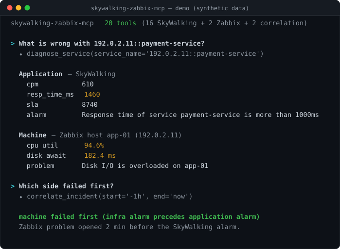

# skywalking-zabbix-mcp

[](https://github.com/ningjiabing/skywalking-zabbix-mcp/actions/workflows/ci.yml)
[](https://pypi.org/project/skywalking-zabbix-mcp/)
[](https://pypi.org/project/skywalking-zabbix-mcp/)
[](LICENSE)

[简体中文](README.md) | English

An MCP server that puts **SkyWalking (application APM)** and **Zabbix (host monitoring)** in a single process, so an AI assistant can look at application metrics and machine metrics in one conversation — and correlate the two.

**What problem does it solve?** Troubleshooting usually means opening two systems: SkyWalking to see where a service is slow, Zabbix to see whether the box is falling over, and then reasoning about the timeline yourself — did the machine die first and drag the app down, or is this an application bug? This server hands that step to the AI. You ask "what's wrong with `payment-service`" and it pulls both sides and gives you a verdict.

**Why can it correlate automatically?** A SkyWalking service name has the form `<IP>::<service>` (e.g. `192.0.2.11::payment-service`), and that IP segment is exactly the host name in Zabbix. The two sides align on IP naturally — **no service↔host mapping table to maintain**.

<p align="center">
  
</p>

<p align="center">
  <sub>Real server code against a <a href="docs/demo/">mock backend</a>; the data is synthetic. Reproduce it with <code>uv run python docs/demo/run_demo.py</code>.</sub>
</p>

---

## Two shapes

| Configuration | What you get |
|---|---|
| `SW_*` only | **Pure SkyWalking**: 16 tools + 10 prompts + 4 resources |
| plus `ZABBIX_URL` etc. | **Application + machine**: the 16 above + 2 Zabbix + 2 cross-stack = **20 tools** |

In other words: **the 4 Zabbix/correlation tools are registered only when `ZABBIX_URL` is set**; otherwise the server degrades to a pure SkyWalking server.

---

## Quick start

### 1. Install (pick one)

**A. uvx — no clone, one line (recommended)**

```bash
uvx skywalking-zabbix-mcp --version
```

**B. Docker**

```bash
docker run --rm -i \
  -e SW_URL=http://<oap-host>:12800 \
  ghcr.io/ningjiabing/skywalking-zabbix-mcp
```

**C. From source (if you intend to change the code)**

```bash
git clone https://github.com/ningjiabing/skywalking-zabbix-mcp.git
cd skywalking-zabbix-mcp
uv sync
uv run skywalking-zabbix-mcp --version
```

### 2. Wire it into an AI client

<details open>
<summary><b>Claude Code</b></summary>

```bash
claude mcp add obs -s user \
  -e SW_URL=http://<oap-host>:12800 \
  -e ZABBIX_URL=http://<zabbix-host>/zabbix/api_jsonrpc.php \
  -e ZABBIX_USER=<user> -e ZABBIX_PASSWORD='${MY_ZBX_PWD}' \
  -e READ_ONLY=true \
  -- uvx skywalking-zabbix-mcp
```
</details>

<details>
<summary><b>Claude Desktop</b> (<code>claude_desktop_config.json</code>)</summary>

```json
{
  "mcpServers": {
    "obs": {
      "command": "uvx",
      "args": ["skywalking-zabbix-mcp"],
      "env": {
        "SW_URL": "http://<oap-host>:12800",
        "ZABBIX_URL": "http://<zabbix-host>/zabbix/api_jsonrpc.php",
        "ZABBIX_USER": "<user>",
        "ZABBIX_PASSWORD": "${MY_ZBX_PWD}",
        "READ_ONLY": "true"
      }
    }
  }
}
```
</details>

<details>
<summary><b>Cursor</b> (<code>.cursor/mcp.json</code>, or global <code>~/.cursor/mcp.json</code>)</summary>

```json
{
  "mcpServers": {
    "obs": {
      "command": "uvx",
      "args": ["skywalking-zabbix-mcp"],
      "env": {
        "SW_URL": "http://<oap-host>:12800",
        "READ_ONLY": "true"
      }
    }
  }
}
```
</details>

<details>
<summary><b>Codex CLI</b> (<code>~/.codex/config.toml</code>)</summary>

```toml
[mcp_servers.obs]
command = "uvx"
args = ["skywalking-zabbix-mcp"]

[mcp_servers.obs.env]
SW_URL = "http://<oap-host>:12800"
ZABBIX_URL = "http://<zabbix-host>/zabbix/api_jsonrpc.php"
ZABBIX_USER = "<user>"
READ_ONLY = "true"
```

Equivalent one-liner:

```bash
codex mcp add obs -- uvx skywalking-zabbix-mcp
```

Note that Codex uses TOML and the key is `mcp_servers` (underscore), unlike the JSON `mcpServers` used by Claude and Cursor. Keep passwords in your shell environment for the Codex process to inherit rather than writing them into `config.toml`.
</details>

<details>
<summary><b>VS Code</b> (<code>.vscode/mcp.json</code>)</summary>

```json
{
  "servers": {
    "obs": {
      "type": "stdio",
      "command": "uvx",
      "args": ["skywalking-zabbix-mcp"],
      "env": {
        "SW_URL": "http://<oap-host>:12800",
        "READ_ONLY": "true"
      }
    }
  }
}
```
</details>

<details>
<summary><b>From a source checkout</b> (replace <code>uvx skywalking-zabbix-mcp</code>)</summary>

```json
{
  "command": "uv",
  "args": ["--directory", "/absolute/path/skywalking-zabbix-mcp", "run", "skywalking-zabbix-mcp"]
}
```
</details>

> Always reference credentials through `${ENV}` (see [Configuration](#configuration)) rather than writing them literally into a command line or config file. `.env.example` lists every variable.

### 3. Run it directly (stdio / HTTP)

```bash
uvx skywalking-zabbix-mcp                                  # stdio, default
uvx skywalking-zabbix-mcp sse --port 8000
uvx skywalking-zabbix-mcp streamable --port 8000 --path /mcp
```

> ⚠️ **The sse and streamable transports have no authentication**, and bind to `127.0.0.1` by default. Binding anywhere else hands read access to your OAP and Zabbix — and write access too, unless `READ_ONLY` is set — to anyone who can reach the port. Put an authenticating reverse proxy in front, or restrict it at the network level. See [SECURITY.md](SECURITY.md).

### 4. Try one line

> "Diagnose `192.0.2.11::payment-service`"

The server runs `diagnose_service` and returns, in one shot, the application metrics for that service (cpm / response time / SLA + alarms) and the Zabbix data for the host carrying it (CPU / memory / IO + current problems).

---

## Tools

### SkyWalking (16, always available)

| Group | Tools | Purpose |
|---|---|---|
| **Metadata** | `list_layers` `list_services` `list_instances` `list_endpoints` `list_processes` | List layers / services / instances / endpoints / processes |
| **Topology** | `query_services_topology` `query_instances_topology` `query_endpoints_topology` `query_processes_topology` | Call topology at four granularities |
| **Traces** | `query_traces` | Query traces; summary / errors_only / full views, v1/v2 protocol auto-selected |
| **Metrics** | `execute_mqe_expression` `list_mqe_metrics` `get_mqe_metric_type` | Run MQE expressions, list available metrics, look up metric type |
| **Alarms/events/logs** | `query_alarms` `query_events` `query_logs` | Query alarms, events, logs |

### Zabbix (2, enabled by `ZABBIX_URL`)

| Tool | Purpose |
|---|---|
| `zabbix_query` | Execute any Zabbix JSON-RPC method (`host.get` / `item.get` / `problem.get` / `history.get`…). In read-only mode only `*.get` passes |
| `zabbix_list` | List common methods + probe the API version live |

### Cross-stack correlation (2, enabled by `ZABBIX_URL`)

| Tool | Purpose |
|---|---|
| `diagnose_service` | Give it a SkyWalking service name, get back the **application side** (cpm / resp_time / sla + alarms) **and the machine side** (CPU/memory/IO + current problems of the host at that IP) |
| `correlate_incident` | Align alarms from both sides within a time window and decide whether the machine or the application failed first |

### Also included

- **10 prompts** (investigation guides): `analyze-performance` `compare-services` `top-services` `investigate-traces` `trace-deep-dive` `analyze-logs` `explore-service-topology` `generate_duration` `build-mqe-query` `explore-metrics`
- **4 resources** (MQE docs): `mqe://docs/syntax`, `mqe://docs/examples`, `mqe://docs/ai_prompt` (static), `mqe://metrics/available` (dynamic, lists backend metrics live)

---

## Configuration

Everything is environment variables. Credential values support `${ENV}` expansion (e.g. `SW_PASSWORD=${MY_SW_PWD}`) to avoid plaintext. See `.env.example`.

| Variable | Meaning | Default |
|---|---|---|
| `SW_URL` | OAP address, `/graphql` appended automatically | `http://localhost:12800/graphql` |
| `SW_USERNAME` / `SW_PASSWORD` | SkyWalking Basic Auth | empty |
| `SW_INSECURE` | Skip TLS verification (testing only) | `false` |
| `SW_LOG_LEVEL` | Log level | `info` |
| `ZABBIX_URL` | Full path to Zabbix `api_jsonrpc.php`. **Setting it enables the Zabbix + correlation tools** | empty (disabled) |
| `ZABBIX_USER` / `ZABBIX_PASSWORD` | Zabbix account | empty |
| `READ_ONLY` | Read-only guard: rejects every non-`*.get` Zabbix method | `false` |
| `VERIFY_SSL` | Verify Zabbix TLS | `true` |
| `ZABBIX_SKIP_VERSION_CHECK` | Compatibility placeholder (this client does not enforce a version; no-op) | `false` |

> **Get the `ZABBIX_URL` path right**: a sub-path install looks like `http://host/zabbix/api_jsonrpc.php`, a root install like `http://host:port/api_jsonrpc.php`. Wrong path → straight 404.

The full JSON forms are in [Wire it into an AI client](#2-wire-it-into-an-ai-client) above.

---

## Typical usage

| Scenario | How |
|---|---|
| **Whole picture in one line** | `diagnose_service("192.0.2.11::payment-service")` — application metrics + alarms + machine metrics + problems of the host, in one call |
| **Who failed first** | `correlate_incident(time window)` — alarms from both sides aligned in time, machine failure vs application anomaly |
| **Drill into traces** | `query_traces` for slow/error traces, with the `trace-deep-dive` prompt to pin down the expensive span |
| **Run a metric expression** | `execute_mqe_expression`; if you don't know the syntax, read `mqe://docs/syntax` or use the `build-mqe-query` prompt |

---

## Compatibility

**Old and new OAP both work** — the backend version and schema capabilities are probed at startup, and queries are trimmed to what the backend actually supports:

- Version probe (`version` → major.minor): metadata / endpoints / trace use v1 or v2 queries per version.
- Schema capability probe (introspection): alarm / MQE selection sets are trimmed to the fields the backend actually has, avoiding validation errors on older releases.
- Legacy MQE syntax is rewritten automatically: `service_percentile{p='50,90'}` → `{_='0,2'}`, and results are mapped back to `p` labels.
- `coldStage` is only sent when cold data is requested (older OAP has no such field).

**Zabbix 4.0 compatible** — PHP-polluted responses are de-noised, the `user` login parameter, the body-level `auth` field and the `/zabbix/` sub-path are all handled automatically.

**Security** — the 16 SkyWalking tools are read-only queries by nature; with `READ_ONLY=true` the Zabbix side allows only `*.get` and rejects every write method. Read [SECURITY.md](SECURITY.md) before deploying: credential handling, unauthenticated HTTP transports, and the fact that tool output reaches an LLM all need a decision for your environment.

**Minimal dependencies** — just `fastmcp` + `httpx`.

---

## Development

```bash
uv sync                      # runtime + dev dependencies
uv run pre-commit install    # ruff / private-key detection / gitleaks
uv run ruff check . && uv run ruff format --check .
uv run mypy
uv run pytest --cov
```

The suite covers GraphQL client auth and error surfaces, backend version/capability probing and caching, trace v1/v2 protocol selection and all three views, legacy MQE rewriting, Zabbix login/re-login/read-only guard/PHP de-noising, both cross-stack tools end to end, and the "16 tools alone, 20 with Zabbix" contract itself.

See [CONTRIBUTING.md](CONTRIBUTING.md) to contribute.

## License

Apache License 2.0 — see [`LICENSE`](LICENSE) and [`NOTICE`](NOTICE). The SkyWalking query documents and prompt texts are derived from the Apache SkyWalking project; the original license is preserved across the port. Release history is in [CHANGELOG.md](CHANGELOG.md).
